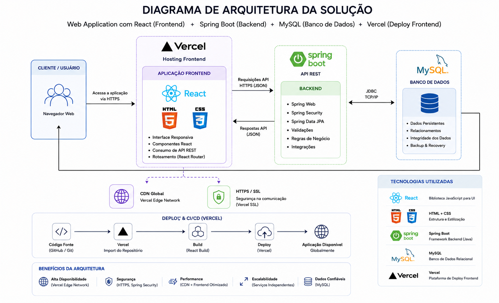
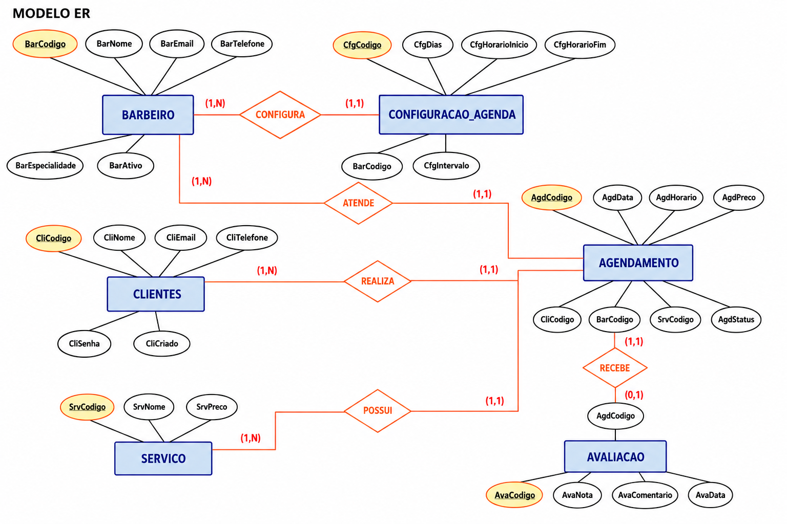
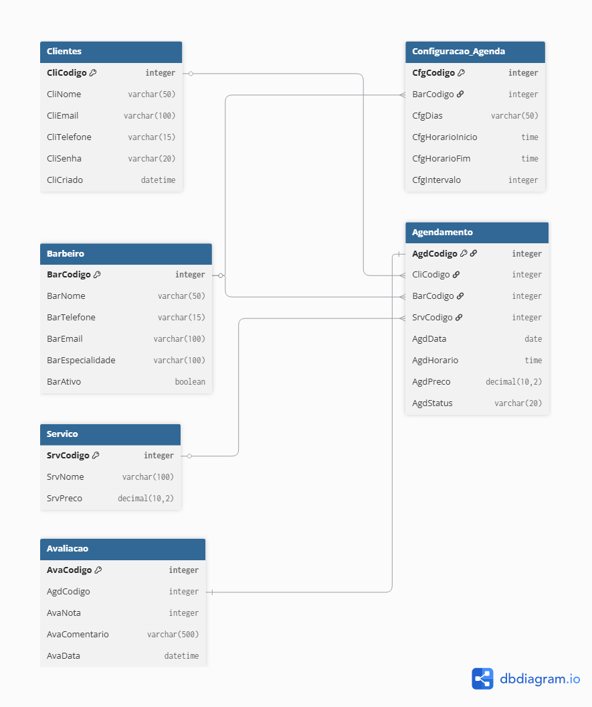

## 4. Projeto da Solução

Pré-requisitos: <a href="03-Modelagem do Processo de Negocio.md"> Modelagem do Processo de Negocio</a>

## 4.1. Arquitetura da solução

O diagrama mostra como a aplicação funciona e como as tecnologias se conectam.

O usuário acessa o sistema pelo navegador. A parte visual da aplicação é feita com HTML, CSS e React, garantindo uma interface moderna e responsiva. Essa aplicação é hospedada na Vercel.

O React se comunica com o backend desenvolvido em Spring Boot, que é responsável por processar as informações e regras do sistema. Os dados são armazenados no banco de dados MySQL.

Toda a comunicação acontece de forma segura, e a arquitetura foi organizada para oferecer bom desempenho, facilidade de manutenção e escalabilidade da aplicação.

 
 
### 4.2. Protótipos de telas

# Cadastro

# Código 
[Cadastro-Login](../src/src/components/Cadastro-Login-Barber.jsx)

# Agendamento Cliente 

# Código 
[Agendamento-Cliente](../src/src/components/AgendamentoCliente.jsx)

# Agendamento Barbeiro

# Código 
[Agendamento-Barbeiro](../src/src/components/AgendamentoBarbeiro.jsx)

# Agendamento Visualização Barbeiro

# Código 
[Visualização-Barbeiro](../src/src/components/VisualizacaoBarbeiro.jsx)

## Diagrama de Classes

### 4.3. Modelo de dados

#### 4.3.1 Modelo ER

<<<<<<< HEAD
O Modelo ER representa através de um diagrama como as entidades (coisas, objetos) se relacionam entre si na aplicação interativa.

=======

>>>>>>> 51392b10bfe8f54fff46bf0b92662e05281ce716

#### 4.3.2 Esquema Relacional

O Esquema Relacional corresponde à representação dos dados em tabelas juntamente com as restrições de integridade e chave primária.
 

---

#### 4.3.3 Modelo Físico

<code>

<<<<<<< HEAD
-- Tabela de Clientes
CREATE TABLE Clientes (
    CliCodigo INTEGER PRIMARY KEY,
    CliNome VARCHAR(50),
    CliEmail VARCHAR(100),
    CliTelefone VARCHAR(15),
    CliSenha VARCHAR(20),
    CliCriado DATETIME
);
=======
Table Clientes {
  CliCodigo integer [pk]
  CliNome varchar(50)
  CliEmail varchar(100)
  CliTelefone varchar(15)
  CliSenha varchar(20)
  CliCriado datetime
}
>>>>>>> 51392b10bfe8f54fff46bf0b92662e05281ce716

-- Tabela de Barbeiros
CREATE TABLE Barbeiro (
    BarCodigo INTEGER PRIMARY KEY,
    BarNome VARCHAR(50),
    BarTelefone VARCHAR(15),
    BarEmail VARCHAR(100),
    BarEspecialidade VARCHAR(100),
    BarAtivo BOOLEAN
);

-- Tabela de Serviços
CREATE TABLE Servico (
    SrvCodigo INTEGER PRIMARY KEY,
    SrvNome VARCHAR(100),
    SrvPreco DECIMAL(10,2)
);

-- Tabela de Regras de Agenda
CREATE TABLE Configuracao_Agenda (
    CfgCodigo INTEGER PRIMARY KEY,
    BarCodigo INTEGER,
    CfgDias VARCHAR(50),
    CfgHorarioInicio TIME,
    CfgHorarioFim TIME,
    CfgIntervalo INTEGER,
    FOREIGN KEY (BarCodigo) REFERENCES Barbeiro(BarCodigo)
);

-- Tabela de Agendamentos
CREATE TABLE Agendamento (
    AgdCodigo INTEGER PRIMARY KEY,
    CliCodigo INTEGER,
    BarCodigo INTEGER,
    SrvCodigo INTEGER,
    AgdData DATE,
    AgdHorario TIME,
    AgdPreco DECIMAL(10,2),
    AgdStatus VARCHAR(20),
    FOREIGN KEY (CliCodigo) REFERENCES Clientes(CliCodigo),
    FOREIGN KEY (BarCodigo) REFERENCES Barbeiro(BarCodigo),
    FOREIGN KEY (SrvCodigo) REFERENCES Servico(SrvCodigo)
);

-- Tabela de Avaliação de Serviço
CREATE TABLE Avaliacao (
    AvaCodigo INTEGER PRIMARY KEY,
    AgdCodigo INTEGER UNIQUE, -- Garante que cada agendamento receba apenas uma avaliação
    AvaNota INTEGER,
    AvaComentario VARCHAR(500),
    AvaData DATETIME,
    FOREIGN KEY (AgdCodigo) REFERENCES Agendamento(AgdCodigo)
);

</code>

### 4.4. Tecnologias.

Para o desenvolvimento do sistema de barbearia serão utilizadas tecnologias voltadas para frontend, backend, banco de dados e deploy da aplicação. O frontend será desenvolvido com React, HTML e CSS, responsáveis pela interface e interação do usuário. O backend utilizará Spring Boot para criação da API REST e regras de negócio. O armazenamento dos dados será realizado no MySQL. Já o deploy da aplicação será feito na plataforma Vercel.

O funcionamento do sistema ocorrerá da seguinte forma: o usuário acessa o frontend pelo navegador, que envia requisições para a API Spring Boot. O backend processa as informações, realiza consultas no banco MySQL e retorna as respostas para o usuário.

| **Dimensão**   | **Tecnologia**  |
| ---            | ---             |
| SGBD           | MySQL           |
| Front end      | HTML+CSS+React    |
| Back end       | SpringBoot |
| Deploy         | Versel    |
| Versionamento  | GITHUB    |
